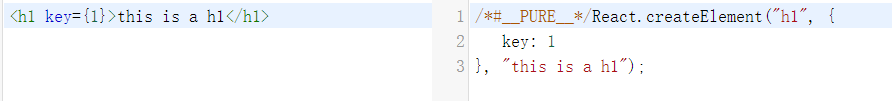
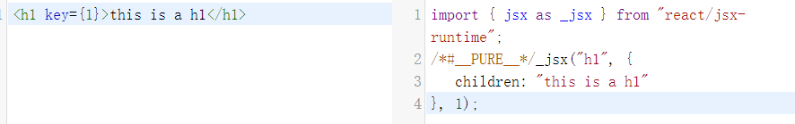
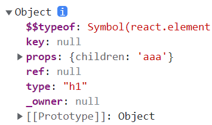

## Jsx元素
JSX是书写在jsx文件中的看似JavaScript语法但又包含Html标签的一种新的写法。jsx为Javascript的一种扩展语法,tsx则为TypeScript 的扩展语言。其书写看起来有JS也有Xml标签。JSX是ReactApp组成的最小单元元素，React使用Bable编译器将Jsx转换为js对象，提供给React进行页面渲染。
## react如何处理jsx
在react18中，有两种方式处理Jsx元素，分别是createElement和

jsx这两个函数的调用

比如处理同一个标签，两种方式处理的代码分别是

> createElement



> jsx



以上就是经过babel编译转化以后的真是调用，不难看出这两种方式这两种处理方式的主要区别是children和key的位置不同，在reactCreateElement中，key是在porps中的，children是在第三个参数中的，而在jsx中children则是在props中，而key则是在第三个参数中。

这两个函数调用返回的是一个js对象，也就是我们常说的vnode



在react17以后的版本，都是采用jsx函数调用处理的jsx，jsx的主要代码就在react/jsx/jsxElement中

```js
import hasOwnProperty from "shared/hasOwnProperty";
import { REACT_ELEMENT_TYPE } from "../../shared/ReactSymbols";
export const ReactCurrentOwner = { current: null };

// 保留属性
const RESERVED_PROPS = {
  key: true,
  ref: true,
  __self: true,
  __source: true,
};

const ReactElement = function (type, key, ref, self, source, owner, props) {
  const element = {
    // 表示是react元素 react中大部分的 $$typeof就是这个
    $$typeof: REACT_ELEMENT_TYPE,
    type,
    key,
    ref,
    props,
    _owner: owner,
  };
  // Object.defineProperty(element, '_self', {})
  // Object.defineProperty(element, '_source', {})
  return element;
};

/**
 * 在react17之后新版的转化 key是在第三个参数的
 * children是在config中的
 * @param {*} type html标签
 * @param {*} config  props
 * @param {*} maybeKey key
 * @param {*} source 
 * @param {*} self
 * @returns js对象
 */
export function jsxDEV(type, config, maybeKey, source, self) {
  let propName; // 属性名
  const props = {}; // 属性对象
  let key = null; // 区分不同的子节点
  let ref = null; // 引用 {current: null} useRef createRef
  if (maybeKey !== undefined) {
    key = "" + maybeKey;
  }
  if (config.key !== undefined) {
    key = "" + config.key;
  }
  if (config.ref !== undefined) {
    ref = config.ref;
  }
  // 遍历属性赋值
  for (propName in config) {
    // 保留的属性是不拷贝的
    if (
      hasOwnProperty.call(config, propName) &&
      !RESERVED_PROPS.hasOwnProperty(propName)
    ) {
      props[propName] = config[propName];
    }
  }
  // 返回react元素
  return ReactElement(
    type,
    key,
    ref,
    self,
    source,
    ReactCurrentOwner.current,
    props
  );
}

```

